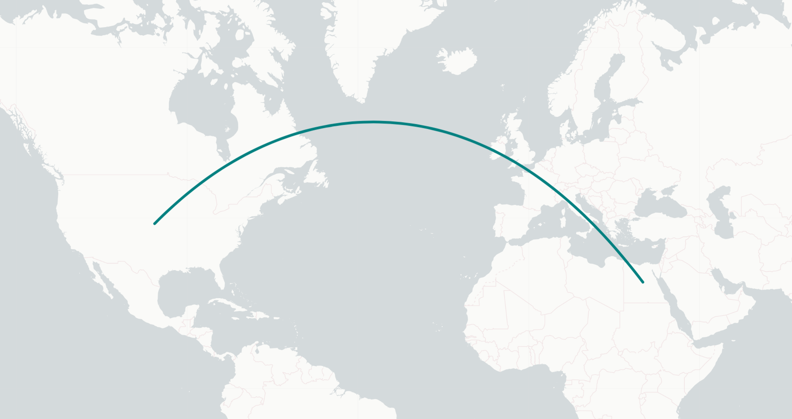

# 🌎 Leaflet.SmoothGeodesic Site

---

## [Live Site](https://leaflet-smoothgeodesic.netlify.app/)

This site is meant to show off the capabilities of the [Leaflet.SmoothGeodesic](https://github.com/hunter547/Leaflet.SmoothGeodesic) npm package.
